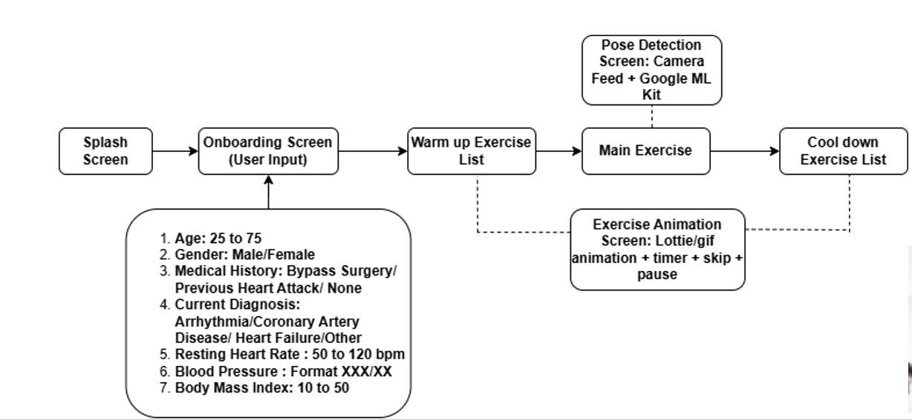
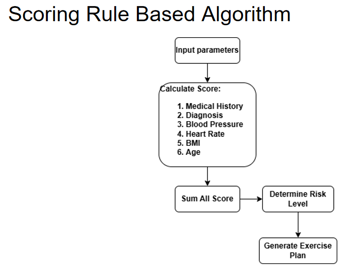
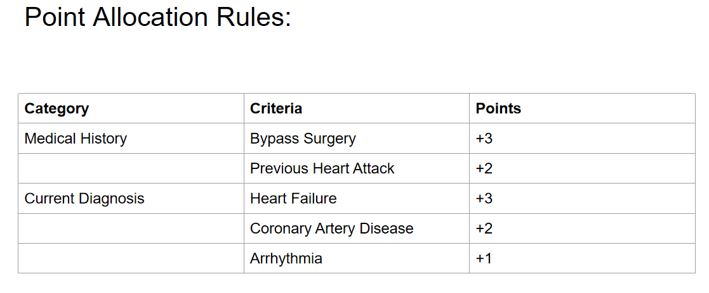
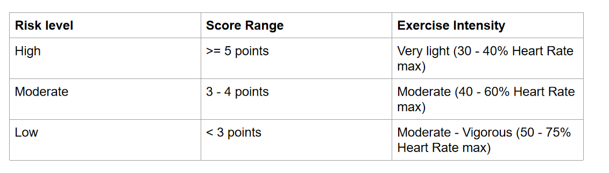
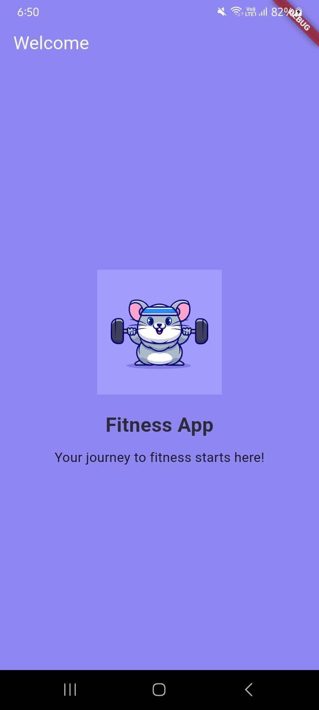
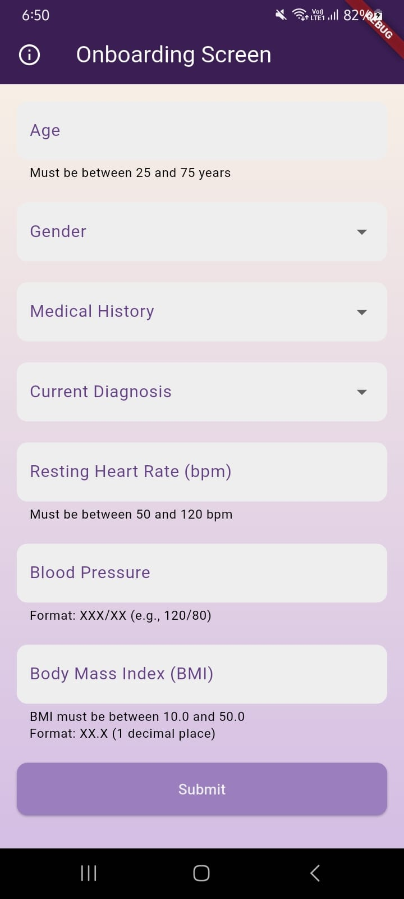
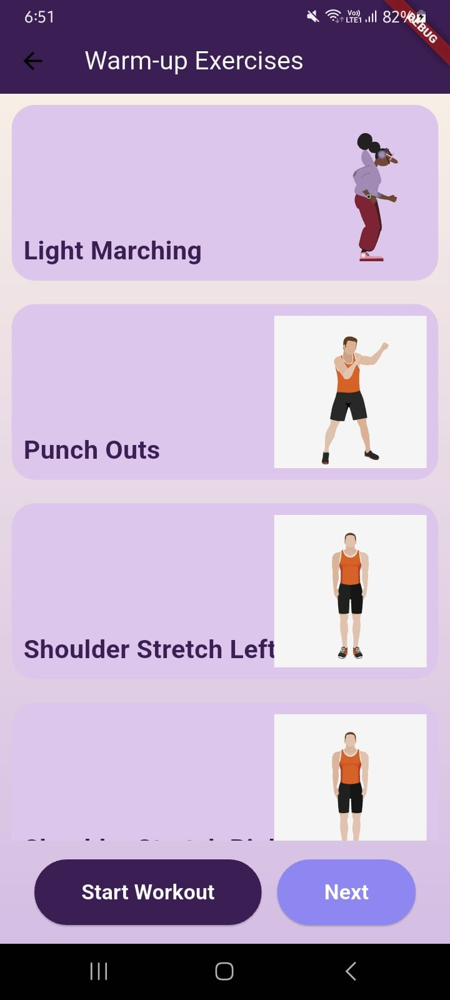
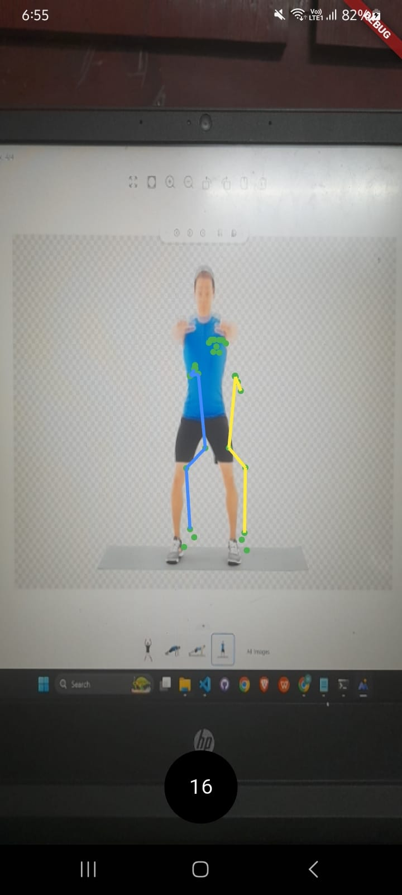
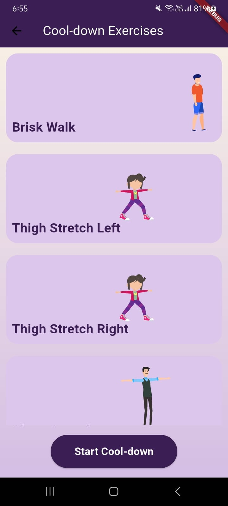

# 💓 CardioCare AI – Real-Time Pose Detection for Cardiac Rehabilitation

**CardioCare AI** is a Flutter-based mobile application that leverages **Google ML Kit** to assist cardiac patients with safe, structured, and guided exercise sessions. It includes **personalized warm-up and cool-down routines** and uses **real-time pose detection** to monitor body movements, ensuring patients perform rehab exercises correctly and safely.

This project was built specifically for a hackathon to solve the growing challenge of accessible and at-home cardiac rehabilitation using mobile AI technologies.

---

## 🎯 Problem Statement

Cardiac rehabilitation is essential for patients recovering from heart-related conditions, yet access to supervised care is often limited.  
Traditional rehab methods:
- Require frequent hospital visits
- Are not always personalized
- Lack technology-driven assistance
- Are often difficult for elderly patients to follow alone

---

## 💡 Our Solution

**CardioCare AI** bridges the gap between clinical rehab and home-based recovery. It provides:
- A simple, clean mobile interface
- Structured warm-up and cool-down sessions
- A real-time pose detection screen powered by Google ML Kit
- An onboarding experience that prepares users for safe exercise sessions

---

## 🧰 Toolstack Used

### 💻 Languages & Frameworks
- **Dart** – Primary programming language  
- **Flutter** – Cross-platform mobile app development framework

### 🤖 Machine Learning
- **Google ML Kit – Pose Detection API**  
  Detects and tracks 33 skeletal points in real time using a smartphone camera.

### 🎨 UI & Animation
- **Flutter Widgets** – For all screens and user flows  
- **Lottie Animations** – (If used) for showing engaging onboarding visuals

---

## 🧠 Core Screens

| Screen Name              | Purpose                                                                 |
|--------------------------|-------------------------------------------------------------------------|
| **Splash Screen**        | Displays logo and app name briefly on launch                            |
| **Onboarding Screen**    | Collects cardiac patient vitals for customized exercise plan            |
| **Warm-Up Screen**       | Presents a set of simple pre-exercise routines                          |
| **Pose Detection Screen**| Activates the camera and tracks user movements via ML Kit               |
| **Cool-Down Screen**     | Guides users through relaxing stretches and breathing after workout     |

---

## 🏗️ Project Architecture

Below is the architecture diagram showing how different components interact:



---

## 🧮 Scoring Algorithm

We implemented a rule-based scoring algorithm to stratify user risk levels. Based on conditions like heart disease, past surgeries, and vitals, users are assigned to Low, Moderate, or High Risk categories.

### 📌 Algorithm Overview



### 📋 Point Allocation Logic

Here’s how we assign points based on different medical and physical factors:

| Point Conditions – 1 | Point Conditions – 2 | Point Conditions – 3 |
|----------------------|----------------------|----------------------|
|  |  |  |

---

## 🎥 Demo Video

- [🔗 Watch Live Demo on YouTube](https://youtu.be/your-demo-link)
- [⬇️ Download APK (Google Drive)](https://drive.google.com/file/d/1y0uLT5pFFebeldfgWsyy2pcWx2kLxqwj/view?usp=sharing)

---

## 🖼️ Screenshots

| Splash | Onboarding | Warm-Up | Pose Detection | Cool-Down |
|--------|------------|---------|----------------|-----------|
|  |  |  |  |  |

---

## 🏁 Accomplishments

- Developed a fully functional Flutter app within the hackathon timeframe  
- Integrated real-time pose detection with Google ML Kit  
- Designed and implemented a rule-based risk assessment algorithm  
- Created a clean, user-friendly interface for guided cardiac exercise  
- Kept everything on-device, without requiring internet or cloud storage  

---

## 🧠 What We Learned

- How to effectively use ML Kit for pose tracking in real-world use cases  
- Structuring a health-tech app for both UX and medical safety  
- Managing real-time camera input in Flutter  
- Leveraging LLM tools (e.g., ChatGPT, GitHub Copilot) for:
  - Flutter UI code generation  
  - Debugging pose logic  
  - Writing concise, readable documentation  

---

## 🔮 What’s Next for CardioCare AI

- 🗣️ Voice-guided exercise instructions  
- 📊 Health data input for more precise scoring  
- 🌐 Multi-language support  
- 🕹️ Gamified rewards to motivate regular usage  
- 🧠 Advanced pose error detection and suggestions  
- 🤝 Clinical validation and testing with medical professionals

---

## 👤 Developer

**Haridas Nishita**  
Email: [haridasnishitha12@gmail.com]  
GitHub: [github.com/Haridas-Nishita](https://github.com/Haridas-Nishita)

---

## 📜 License

This project is for educational and hackathon purposes only. It is not a certified medical product.

---

## 📂 How to Run Locally

```bash
git clone https://github.com/Haridas-Nishita/CardioCareAI.git
cd CardioCareAI
flutter pub get
flutter run
